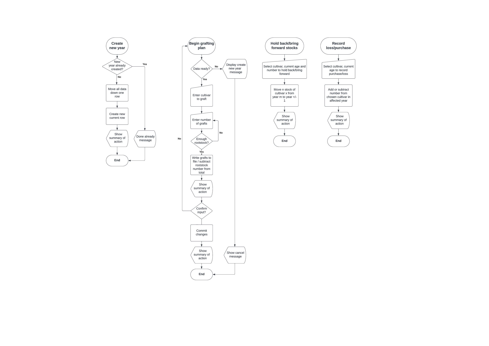
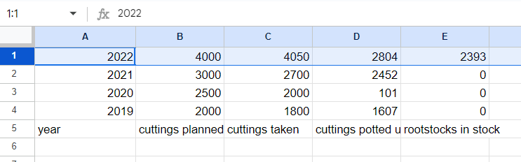
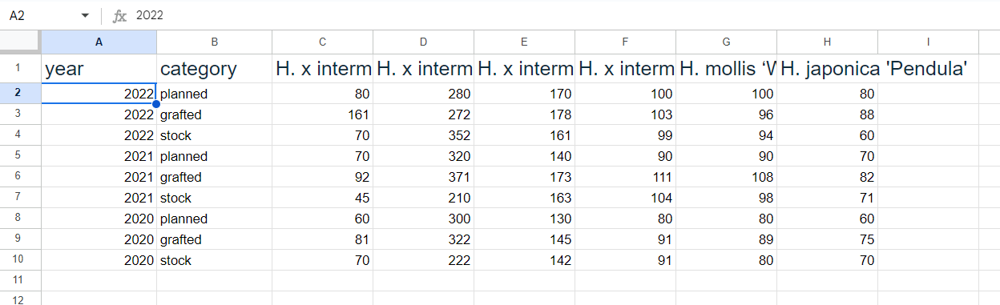
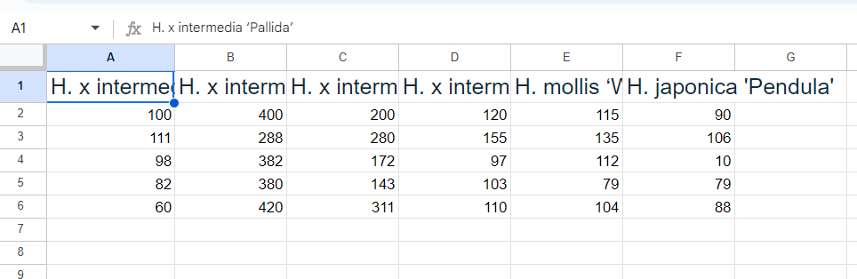

# witch-hazel
A bespoke command-line app developed in Python to manage the *Witch Hazel* nursery.

Code Institute - Third Milestone Project: Create a user-responsive command-line app to manage a particular domain task, solving a real-world, using a variety of programming constructs.The domain task in this case was the production of high-value garden plants by grafting as practiced by the *Witch Hazel* nursery.

More specifically, the *witch-hazel* app is designed to provide support for planning and keeping track of work done in the production of grafted Hamamelis plants by the owners of the nursery.


*A very common cultivar of H. x intermedia ('Arnold Promise') giving a spectacular show of leaf colour in mid-October*

<!-- TOC start (generated with https://github.com/derlin/bitdowntoc) -->

- [The user story](#the-user-story)
   * [Specialist growers](#specialist-growers)
   * [The plant production workflow](#the-plant-production-workflow)
- [What the customer wants](#what-the-customer-wants)
- [System design](#system-design)
   * [The 'rootstock' worksheet ](#the-rootstock-worksheet)
   * [The 'grafts-year-zero' worksheet](#the-grafts-year-zero-worksheet)
   * [The 'plants' worksheet](#the-plants-worksheet)
- [The program's original workflow and the technical issues with the technology used](#the-programs-original-workflow-and-the-technical-issues-with-the-technology-used)
- [The program's workflow:](#the-programs-workflow)
   * [Seasonal tasks in order](#seasonal-tasks-in-order)
   * [ad-hoc tasks](#ad-hoc-tasks)
- [Bug fixes and warning resolution](#bug-fixes-and-warning-resolution)
   * [Bugs](#bugs)
   * [Warnings](#warnings)
- [App robustness](#app-robustness)
   * [Numerical vs character/string entries](#numerical-vs-characterstring-entries)
   * [Out of range numbers](#out-of-range-numbers)
   * [Yes or no responses](#yes-or-no-responses)
- [Programming philosophy](#programming-philosophy)
- [Sharing the hamamelis google spreadsheet](#sharing-the-hamamelis-google-spreadsheet)
- [Registering for Heroku and using it](#registering-for-heroku-and-using-it)
- [Lessons learned](#lessons-learned)
- [Other unresolved issues and future development](#other-unresolved-issues-and-future-development)
- [Credits](#credits)

<!-- TOC end -->

<!-- TOC --><a name="the-user-story"></a>
## The user story

Laura and Donal are joint owners in a specialist horticultural business based in rural Roscommon. Their main business is in growing and selling wholesale high-value shrubs and flowering plants, mostly to garden centres all over Ireland and Europe.


<!-- TOC --><a name="specialist-growers"></a>
### Specialist growers

Their company, *Witch Hazel*, is named after the beautiful group of plant species (all grouped under the genus name _Hamamelis_) upon whose propagation the couple made their reputation soon after leaving agricultural college. This genus, whose English-language common name is the Witch Hazel, is a slow-growing shrub that produces masses of delicate yellow, orange or red flowers in mid to late winter and whose leaves turn spectacularly coloured in autumn. Most of the cultivars grown by Laura and Donal are descended from _Hamamelis x intermedia_, a cross between Japanese witch hazel (_H. japonica_) and Chinese witch hazel (_H. mollis_), but they also grow for sale cultivars of both parent species (i.e., _H. mollis_ and _H. japonica_). All the plants they grow for sale are propagated by means of grafting buds onto root stocks of a third Hamamelis species, _H. virginiana_, the American Witch Hazel, which doesn't produce either such beautiful winter flowers or such rich autumn leaf colours as any of its East Asian relatives, but provides a hardy root upon which the its more spectacular relatives can thrive. Another advantage of the procedure is that grafted plants will begin flowering several years younger than plants grown on their own root. The labour cost of producing such grafts is what drives the high market value of garden varieties of Witch Hazel on the wholesale and retail markets.


<!-- TOC --><a name="the-plant-production-workflow"></a>
### The plant production workflow

The two owners have jointly developed a highly efficient way of producing such grafted plants. They have a plentiful standing stock of _H. virginiana_, which they propagate by taking soft-wood cuttings in the autumn, which they leave to root over the course of the Roscommon winter (year zero). The following spring (around about April), they pot up all the cuttings that have rooted successfully into oblong three-litre pots and grow them on until they become small, one-year-old pot plants. In late winter of Year One (usually early to mid March), they graft onto those young plants (referred to as 'rootstocks') carefully selected buds (called 'scions') taken from their lovingly tended stock of mature cultivar specimens. The resulting grafted plants are then cared for for four to five years before being offered on the market as small bushes (about 50 to 60 cm tall) still in their original pots. Once the graft has sealed successfully (there may be considerable losses during the period before the graft seals), caring for the small plants becomes a good deal less labour-intensive; the work mostly involving keeping them watered and fed (and free of waterlogging), controlling weeds, and removing and disposing of any losses. The vast majority of the work is expended on at the early stages of production: making and potting up the rootstocks from cuttings and then grafting the scions onto those rootstocks when they are ready. The early aftercare of the new grafts also takes up quite a deal of work time. For this reason, the profitability of each year's production depends largely on guessing correctly how many plants to graft to satisfy demand a few years down the road, and making sure at the outset that they have enough healthy, potted-up root stocks available on which they can graft all the plants they want every year just as winter is turning to spring.

Donal explained the workflow in _Hamamelis_ production as follows:
- Green woody H. virginiana cuttings are taken in October/November and inserted with regular spacing in open ground (in a sheltered spot and well-drained, gritty and nutrient-poor soil). Those of cuttings that successfully produce roots are potted up in April/May of the following year. Donal tells me that most losses at this stage are incurred in the form of cuttings that fail to root. That's why they take many more cuttings than will eventually be needed. Rooted cuttings not needed for grafting almost a year later (in Year Zero &ndash; see below) are disposed of without ever being potted up. The couple always try to avoid such wastage, although after years over which few rooted cuttings die, there will often be a surplus of rootstocks ready for grafting. Such surplus rootstocks are rarely still suitable for grafting a year later, so they are usually disposed of.
- As compost and pots (the only other critical inputs) can be ordered at short notice, neither input represents a bottleneck risk for the couple. They don't need these variables to be modelled in the program for the moment.
- The production process currently does not involve any repotting; each successfully rooted cutting is potted at the very outset into its final three-litre pot.
- The rooted, potted-up cuttings of H. virginiana are grown on for a full season and are readied for grafting in February to March of Year One (the precise time of year depends on the weather and the seasonal maturity of the scion buds to be grafted onto them &mdash;they should be swelling visibly but not yet open).
- The couple can't recall any year in which there was any shortage of scion buds, though actually selecting, cutting and preparing them correctly is a painstaking and time-intensive job.
- Actually joining the scions onto the rootstocks is also a highly skilled and time-consuming task. But here again, the tools and materials required (a grafting knife per worker, grafting tape and horticultural wax) are easy to obtain at short notice.
- After the hard graft of grafting has been completed, the new baby plants are carefully placed in intensive care in the couple's polyethylene tunnel for about two months, during which time there may be substantial losses (up to 40%) through failure of the graft to fuse.
- Once that period is over, the plants are taken outside to a sheltered spot on open ground. Their three-litre pots are buried to the neck in well-drained, humus-rich soil to reduce the risk of drying out. They will remain there for several years until they're large enough for sale. The youngest cohort offered for sale are in their fifth year from Year Zero. All the plants are watered, weeded, cared for and re-spaced where required, and any losses (which are generally much less frequent once the plants have survived year one) are removed intermittently and disposed of.
- Each year's production is kept together and grouped by cultivar, but particular plants that are growing particularly well or particularly slowly may be promoted or demoted to another year cohort where appropriate.
- Unsold Year-Five plants may be repotted and grown on for sale as more mature specimens in subsequent years. However, this part of the production process has not yet been modelled in the *witch-hazel* app.

Both Laura and Donal often refer to "Year Zero", by which they mean the calendar year in which they actually do the biggest job in the whole production process: actually making the grafts. You could say that they make rootstock cuttings in autumn of Year Zero Minus One, pot up the successfully rooted cuttings in the spring of Year Zero and do the grafting work in February to early March of Year One. The plants thus produced are thereafter classified by age, with newly grafted plants being labelled "Year-One plants", which become "Year-Two plants" at grafting time every year, with Year-Two plants becoming Year-Three plants and so on. With a few exceptions, the plants are not ready for sale until they reach Year Five. 

- - -

<!-- TOC --><a name="what-the-customer-wants"></a>
## What the customer wants

Laura and Donal have asked me to provide them with a simple command line program to help them plan their propagation, grafting and crop management activities while the plants are being grown on for sale. They don't need any fancy graphics or sophisticated GUI, but they do want the program to be fairly simple to use and maintain, and to guide them through each step of the workflow. They want it to serve the following purposes:
- maintain a list of the stock of _Hamamelis_ plants destined for sale wholesale to garden centres and the like, grouped according to age/size and cultivar
- plan and keep track of the process of producing the cuttings for rootstocks, potting them up and growing them on
- update and show the number of potted rootstocks available every year for grafting
- plan the numbers of each cultivar to be used as scions on the root stocks, warning the couple when there are not enough rootstocks to execute the plan in full
- record throughout the year any losses incurred (for whatever reasons) by cultivar and age and any acquisitions (whether by purchase from a third party or via any of a number of horticultural tricks that the couple have up their sleeves)
- show the flexibility to allow the couple to hold back particularly slow-growing specimens for another year and to reclassify plants that have grown particularly well in a particular year so that they effectively skip a year. Since they tend to do this sort of work whenever they get time throughout the year, they should be able to do this intermittently at any time of year.

N.B.: They currently grow six different cultivars for sale (but might expand their range in the future if they can find attractive cultivars free of plant breeders' rights fees). The system should be easy to adjust in order to add new cultivars to the workflow.

"That's enough for the moment," said Laura, "once we have a system that can do those things, we'll be able to plan better. And once we've seen the benefits, we'll have a look at what might still need doing. The main thing we need right now is something that keeps our records straight, so we can analyse like with like when looking for areas where we can improve our efficiency and/or rebalance the numbers of the various cultivars we produce. We can start looking at what we still need to do both upstream and downstream of the actual production process ... maybe even in the sales area ... after we've bedded in our initial new system. And we can also have a look at applying the system to our rose production business if it looks like it might save us a bit of time and money there too. But let's not get ahead of ourselves."

- - -

<!-- TOC --><a name="system-design"></a>
## System design



*Some flow charts portraying a selection of important witch-hazel worklflows*


Accordingly, I prepared a series of outline flow charts in consultation with Laura and Donal on the basis of the needs they described to me. Once they'd approved the charts, I began thinking about actually programming the various functionalities.

For simplicity's sake, and because I thought the data was not enormously complex, I decided to store it all on a single google spreadsheet, which I simply named 'hamamelis'. It contains three worksheets.
- rootstock
- grafts-year-zero
- plants

The data should be read as follows.

<!-- TOC --><a name="the-rootstock-worksheet"></a>
### The 'rootstock' worksheet 
- The first column (A) is a label to tell the witch-hazel program what year the figures in the corresponding row refer to. The current year is at the top.
- The top figure in the second column (B) shows the number of cuttings that the couple plan to take in the autumn of the current year minus one. The figures below that represent the number of cuttings that the couple planned to take in each relevant year minus one in the past.
- The third column (C) shows the number of cuttings that they actually took in the relevant year.
- The fourth column (D) shows the number of cuttings that rooted successfully and were potted up during the spring. It is a representation of work done, and does not increase when immature rootstocks are acquired from an outside source, nor does it reduce when such rootstocks are lost through disease or damage, nor when they are used up in the grafting process. Notice the change in nomenclature: successfully rooted _cuttings_ begin to be referred to as _rootstocks_ as soon as they've been planted in pots (potted up).
- The fifth column (E) contains at most two non-zero values: one in E1, which represents the figure for rootstocks in stock this year intended for use as next year as rootstocks. It is equivalent to the value in D1 minus any losse, plus any acquisitions. The value in E2 represents the total number of rootstocks now available for use in this year's grafting effort. Every time a grafting session is recorded, this value goes down by the number of grafts made. 
Any rootstocks left over after the year's grafting campaign is finished remain in the system until they are set to zero upon creation of a new year. The reason for this is that two-year-old rootstocks will rarely be suitable for grafting when the time comes around again in the new year. They are generally physically disposed of (recycling the pots and compost) when the opportunity arises during the course of the new year.


*The rootstock worksheet as it might look towards the end of a growing year*

<!-- TOC --><a name="the-grafts-year-zero-worksheet"></a>
### The 'grafts-year-zero' worksheet
The grafts-year-zero worksheet contains two more columns than the number of cultivars of _Hamamelis_ currently cultivated by the *Witch Hazel* nursery. 
- The first column identifies the year to which the data in the corresponding row refers.
- The second column tells any human or machine reader whether the figures in the corresponding row refer to numbers of grafted plants that the couple originally planned ('planned'), that they actually made ('grafted') and that they currently have in stock ('stock'). The 'stock' figure for the current year refers to the number of plants of the given category currently in stock (i.e., the number of grafts originally made of the relevant cultivar in the current year minus any losses recorded since then, plus any gains since then). When a new year is created, the relevant numbers are passed into the 'plants' worksheet, three new rows are created for the current year and the figures for 'planned' and 'grafted' for previous years can no longer be edited. 
- Each subsequent column gives the same figures as described above for the cultivar labelled in the topmost cell.


*The grafts-year-zero worksheet as it might look towards the end of a growing year*

<!-- TOC --><a name="the-plants-worksheet"></a>
### The 'plants' worksheet
The plants worksheet is a little simpler. It shows the current stocks of each cultivar of each age group &ndash; i.e.: the total number of grafts of that age currently in stock, adjusted according to the losses and gains subsequently recorded by the couple in the witch-hazel program using the record_loss, record_gain, hold_back and bring_forward functions (see below).


*The plants worksheet as it might look towards the end of a growing year*


- - - 

<!-- TOC --><a name="the-programs-original-workflow-and-the-technical-issues-with-the-technology-used"></a>
## The program's original workflow and the technical issues with the technology used

At the outset of programming, I wanted the app to call a run.py file in the usual way but to attach an argument after a blank space on the command line, depending on the task that the user wished to do at that time. Unfortunately, the Heroku pseudo terminal on which the app is destined to run does not allow the use of command-line arguments (or at least I have been unable to find a way of implementing such a command-line-argument-based design). Due to some issues with my implementation of the Heroku architecture, I discovered this limitation rather late in the day. As a result I was forced redesign the app at the last-minuteto follow a different (and in my opinion much less elegant) logic. Originally, the user would have typed the run.py file name on the terminal, followed by a space and then a short string indicating what they wanted the app to do.

For example, they would have typed ``run.py plan_cuttings`` to plan their campaign of taking and preparing cuttings. But the Heroku pseudo-terminal automatically runs the ``run.py`` file without any arguments immediately upon opening, so everything must be based on an argument-free initial call. The description of the workflow below is based on my last-minute changes due to this difficulty. It should be understood, however, that workflow described below was not my first choice.

The time used dealing with this problem at the last minute may have affected some of the finishing work on the program. For example, it was my original intention to connect each task to the next in their logical order, asking the user if they wished to go on to the next task. Sadly, the user now needs to restart the program every time they wish to complete a new task. 

- - - 

<!-- TOC --><a name="the-programs-workflow"></a>
## The program's workflow:

<!-- TOC --><a name="seasonal-tasks-in-order"></a>
### Seasonal tasks in order
Typically towards the autumn of every year, the owners will want to close out the figures they have entered over the previous year, begin a new year and start work on planning their campaign of taking H. Virginiana cuttings. They begin this task by running the app and choosing option ``1`` (``Create new year/Close out current year``). This function adds the required new lines for the new current year on each worksheet, and copies the data on graft stocks for the old current year to date from the ``grafts-year-zero`` worksheet to the ``plants`` worksheet. This has the effect of putting the data for the previous year out of reach of the seasonal tasks.

Also within the ``Create new year/Close out current year`` function, users can choose either to enter the figure for cuttings that they anticipate taking this year or opt to leave that job for later.


*The rootstock worksheet straight after the user executes the* ``Create new year/Close out current year`` *function. Note that the user has chosen to enter a value for planned cuttings of 2,800. That value can be changed at any time during the year by running Option 2* ``Plan this year's cutting campaign``*.*

- - -


*The grafts-year-zero worksheet straight after the user executes the* ``Create new year/Close out current year`` *function.*

- - -


*The plants worksheet straight after the user executes the* ``Create new year/Close out current year`` *function.*

Then, whether or not they have entered a figure for planned cuttings, they can run app option ``2`` ``Plan this year's cutting campaign`` to revise that figure. If they have already recorded a figure for cuttings actually made, they are given a warning to tell them that the cutting campaign has already started and asked to confirm whether they want to replace the planned figure with a new total. The new figure is not added to the old one; it simply replaced it. This is the case with all planning functions.

When they run app option ``3`` (``Record cuttings taken``), they are asked to enter a number of cuttings actually taken. They are given the already existing figure for cuttings taken and warned not to enter a number for cuttings unless that number has already been physically taken, prepared and inserted in the cuttings bed. It tells the user when the number of cuttings taken exceeds the number of cuttings planned.

The new figure entered by the user is added to the already existing number. In the nursery, the cuttings campaign takes several days, the owners typically entering the day's figure for cutting production in the evening of the relevant day. The user receives a message on the command line when the figure exceeds the planned figure. The logic behind the difference between planned figures (each of which simply replaces the previous one) and the actually taken figures is that the latter are usually totted up for each day in the cutting/grafting campaigns, and the user should expect the app to remember the numbers recorded from previous days.

Option ``4`` (``Record rooted cuttings potted up``) instructs the user to enter a figure for the number of successfully rooted cuttings actually potted up. As another figure indicating for work actually done (usually daily), it functions in a similar cumulative way to option ``3`` (``Record cuttings taken``, as do all functions designed to record work actually done). It informs the user when the total number of potted cuttings recorded has reached or exceeded the total number of cuttings taken.

Option ``5`` (``Plan grafts for this year``) displays the number of rootstocks (i.e. the figure for cuttings successfully potted up in the previous year, minus losses, plus gains) asks the user what cultivar they want to graft and how many grafts they want to make of that cultivar. The function keeps a running total of the rootstocks required and issues a notification/warning if and when the total number of planned cuttings exceeds the number of rootstocks available. As the function is about planning numbers, new numbers simply overwrite old ones the second and subsequent time the user runs the option for a particular cultivar.

Option ``6`` (``Record grafts taken``) argument asks the user which cultivar they want to record grafts for. The owners typically enter the day's figure for graft production separately for each cultivar in the evening of the relevant day. The user receives a message on the command line if and when any figure exceeds the associated planned figure. As for other options recording work actually done, new figures are added to old figures creating a new total. Each time a grafting session is recorded in this way, the current stock of rootstocks is reduced by the corresponding amount.

_N.B.: In order to record total work done separately from current stocks (i.e., total work done minus losses plus gains) all the following numbers are recorded separately:_
- _cuttings taken vs total rootstocks_
- _grafts taken vs total plants in stock (recorded for each cultivar separately)_

<!-- TOC --><a name="ad-hoc-tasks"></a>
### ad-hoc tasks
Option ``7`` (``Record plant losses``) asks the user the cultivar and age of the plants they want to record as lost (including year-zero rooted cuttings), showing them the current figure for that cultivar and age. The user is prevented from entering a number greater than that figure. It gives a confirmation message before writing the data entered by the user to the spreadsheet.

Option ``8`` (``Record plant gains``) works similarly, adding instead of subtracting. It does not impose any restriction on the number added.

Option ``9`` (``Hold over plants for one year``) asks the user to identify the cultivar and age of the plants they want to hold back, shows the user the current number of those plants and subtracts the number given by the user from the current age category, adding the same number to the category one year younger. As with ``record_loss``, the user can't move more plants than the recorded number for the relevant category in any direction. The system also prevents the user from entering a value less than two, as it is impossible to hold year-one plants over to year-zero. The year zero values are not recorded in the ``plants`` worksheet at all. They have ther own worksheet (``grafts-year-zero``)

Option ``10`` (``Bring plants forward one year``) does the same in the opposite direction. Again, the appropriate restriction on numbers moved applies. In contrast to the previous option, the user can choose the value ``1`` for year cohort, as the same problem doesn't apply here.

In exceptional cases where the user wishes to hold back or bring forward a number of plants by more than a year, they must run the relevant process twice.

Unfortunately, due to the time restraints, I was unable to implement option ``11`` (``Add new cultivar``). I have, however prepared much of the groundwork to introducing it in the future. For example, I have implemented a system by which the functions that involve cultivars identify those cultivars dynamically.

Reductions in plant stocks through _sales_ are not recorded in this app. The couple tell me that this may well be the next step once they have this work planning system bedded in.

The same can be said of a number of other parts of the nursery workflow.

<!-- TOC --><a name="bug-fixes-and-warning-resolution"></a>
## Bug fixes and warning resolution
<!-- TOC --><a name="bugs"></a>
### Bugs
Bugs were fixed as they arose during smoke testing.

As far as practicable, all Bugs are resolved separately and the Bug resolution is recorded in Git commits separately, prefixing the commit text with "Bug: ".


<!-- TOC --><a name="warnings"></a>
### Warnings
pycodestyle issues (all warnings) were closed shortly before submitting the app project.

Two warnings could not be resolved, but appear not affect the functioning, reading or comprehension of the program in any way! They were:
```
$ pip install pycodestyle
$ pycodestyle ...

  warnings.warn(
run.py:318:22: E231 missing whitespace after ':'
run.py:318:22: E701 multiple statements on one line (colon)
run.py:428:80: E501 line too long (82 > 79 characters)
```

In reality there are at least a dozen warnings relating to lines that are too long, but they do not affect the Heroku pseudo-terminal and do not appear to affect the readability of the code. I corrected them, saw that the caused bugs in the presentation, and even in the running of the code itself, and reversed them (one by one).

<!-- TOC --><a name="app-robustness"></a>
## App robustness

<!-- TOC --><a name="numerical-vs-characterstring-entries"></a>
### Numerical vs character/string entries
Aside from the restrictions on user entries mentioned above, the user must not enter either a negative number or an entry that cannot be rendered as an integer. Sadly, in most cases, I have not had the time to resolve all issues relating to the user entering characters and strings that cannot be converted into integers yet, but I have put the necessary software in place in some functions (notably the opening menu function and functions 6, 7, 8 and 9). I have told the users to be careful not to make non-numerical entries where numerical entries are expected.

<!-- TOC --><a name="out-of-range-numbers"></a>
### Out of range numbers
The app has been designed so that integers entered outside the valid range of values are handled elegantly without the program havin to shut down. Users are shown an appropriate message repeatedly until they make a valid entry.

<!-- TOC --><a name="yes-or-no-responses"></a>
### Yes or no responses
The app is designed so that the user can respond to yes or know answers by entering 'y' or 'Y' for yes; entering any other value than 'y' or 'Y' is interpreted as a no.

---
<!-- TOC --><a name="programming-philosophy"></a>
## Programming philosophy

Being an app generally modelling a procedural series of steps, I made only limited active use of the concepts of OOP in my code: though I used a number of pre-coded classes through importing a number of packages, I created few custom classes specifically for the app. This was deliberate and should not be taken for any absence of understanding of the basic concepts of OOP.

## Manual testing

### Features testing

### Browser compatibility

### Device compatibility and responsiveness

### Code validation

### Bugs and bug squashing

### Lighthouse testing

### Accessibility (webaim coolors)

## Automated testing


## Setting up the environment
The first task I completed was to create the spreadsheet with which Laura and Donal's app are going to interact. As I already have a Google account, there was no need to set up a new account. I simply navigated to https://docs.google.com/spreadsheets and created a Google spreadsheet (called "Hamamelis") that contained the three pages illustrated and explained above, inserting the data given to me by Laura and Donal.

I then set up the google API to give Laura and Donal's new App read and write access the spreadsheet (they will no be allowed to modify the data on the spreadsheet directly by hand).

I did this by clicking on the Share button at top left from within my "Hamamelis" Google spreadsheet and choosing my personal Google account. I then navigated to https://console.cloud.google.com/, selected the "Select a project" button and selected "New project".  I named my project "Hamamelis".

I then clicked "Select Project", which brought me onto the new "Hamamelis" project dashboard page.  

From there I selected the Navigation menu and selected "APIs & Services / Library.

There I enabled two APIs: one for Google Drive (to generate the necessary credentials) and one for Google Sheets.

### The Google Drive API

To initiate the Google Drive API ran a search for "Google Drive", which gave me "Google Drive API" at the top of my search results list. I clicked on it and then on the "Enable"  button on the page that then appeared. This brought me to the Google Drive Overview page.

On this page I clicked on the CREDENTIALS tab and then on the "Create Credentials" button under that tab, I chose Google Drive API from the dropdown menu and then "Application Data" to answer the question "What data will you be accessing?" and then clicked 'Next'.

I entered "hamamelis" as my Service account name, along with a short description of purpose of the service account. I then pressed the "Create and Continue" button, and then chose the role "Editor" and pressed the "Continue" button. Leaving all other actions blank, I then pressed "Done".

This brought me back to the Credentials page for the Google Drive API, where I could see my newly created hamamelis service account at the bottom of the page. I clicked on it to get to the hamamelis service account page and then went to the Keys tab, where I chose "Create new key" from the "Add Key" the dropdown list.

This created a json file containing the necessary API credentials for download to my machine.  Once the download was complete I noted the directory to which it was downloaded.


### The Google sheets API

Once all that was done, I navigated back to the APIs and Services/Library page and searched for the Google Sheets API, which yielded a single result. I clicked on it and then on the Enable button in the Google Sheets API page.


### The Github repository and the Gitpod workspace

I set up the Github repository for my project (under the name "witch-hazel" &ndash; https://github.com/JaimeHyland/witch-hazel) using the template made available by Code Institute at https://github.com/Code-Institute-Org/p3-template by clicking on the "Create a new repository" option on the "Use this template" dropdown list (setting the name as "JaimeHyland/witch-hazel"). I made the repository public (leaving the radio button selected by default as it is).

I then opened my personal CI Students Gitpod dashboard and created a new Workspace including all the files created for the witch-hazel repository by the CI p3-template. I did so by clicking on the Create new workspace button, selecting the witch-hazel repository from the list of all my existing repositories in my personal Github account and then clicking on "Continue". Ihe workspace that then opened, I checked to make sure that all the files listed in the instructional video were present.


### Sharing the hamamelis Google Spreadsheet

I located the credentials file which I had already downloaded and dragged & dropped it into the root directory of my gitpod witch-hazel workspace and then renamed it "creds.json".

I then copied the client_email value from the creds.json file and opened my hamamelis Google Spreadsheet and clicked on the "Share" button at top right. I pasted the client_email value in to the Add people and groups into the text box that then appeared, chose "editor", unchecked the "notify people" checkbox and pressed "Send" and then "Done". This set up the permissions for my app project to access and edit my hamamelis spreadsheet.

To prevent the sensitive information contained in the creds.json file from being added to the files saved in the github repository, I added the file name to the list of files to be ignored by git to the "gitignore" file before running a git stage, commit, push operation.

I then installed gspread and google-auth by typing the commands ``pip3 install gspread google-auth``.

Doing this put me in a position to begin my coding, my first step being to write ``import gspread`` and ``from google-oauth2.service_account import Credentials`` at the top of my run.py file, followed by five constants to be used by the App to maintain communication with my Google spreadsheet:
- SCOPE (which lists the URLs of the three APIs that the App will need in order to run)
- CREDS (which tells the App the file where the relevan credential values are to be found)
- SCOPED_CREDS (which relates the CREDS to the SCOPEd APIs for which they are valid)
- GSPREAD_CLIENT (which represents the client of the App as defined by the SCOPED_CREDS)
- SHEET (the actual spreadsheet the App will be working with)

From here on in, I suggest using the Git commit logs combined with my inline comments to explain the content of my Python code. 


<!-- TOC --><a name="registering-for-heroku-and-using-it"></a>
## Registering for Heroku and using it

### Initial registration

My first step to facilitate deploying my App on the Heroku Python environment  was to add my app's dependencies into my requirements.txt file (which the Heroku environment refers to when installing the necessary features on creation). I do this by running `` pip3 freeze > requirements.txt``, which collects all necessary installations on the Gitpod workspace and writes them into the requirements.txt file.

The next step was to create an account with Heroku at heroku.com. I clicked on "Sign up for free" and filled out the sign-up form (using a genuine email address and with Role as Student and country as Germany), and then clicked "Create free account". I then confirmed via the validation email that Heroku sent me and set a password. And I then logged and accepted the Heroku terms of service.  Heroku now requires a real 16-digit credit or debit card for all its accounts and requires users to implement a minimum two-step validation process to use its hosting services. The form of validation I chose was using a code number sent to my smartphone on each log-in via Salesforce's Authenticator app. After a variety of issues relating to mutually incompatible localizations, limited payment options and complex processes to access the credit organised for me by Code Institute, I was eventually able to set up my account.


### Activating Code Institute's Heroku Student Pack

Once I had successfully set up my Heroku account, I navigated to www.heroku.com/github-students, clicked on the "Get the student offer" option, verified my status as a Github student and then clicked "Authorize heroku". I then verified my billing information and confirmed the credit card that I had already entered.  I then entered my first and last names, with "Code Institute" as my school name, and pressed "Send". On the dialog that then opened, I indicated my agreement with the Heroku Terms and Conditions by pressing "Agree" and left the site.

When I checked my account on the following day (at dashboard.heroku.com/account/billing), the appropriate sum was added to my Platform Credits.


### Setting up our App in the Heroku environment

From my personal dashboard in the Heroku site, I selected "Create new app" from the "New" dropdown list, gave it the app name "witch-hazel", chose "Europe" as its region and then pressed "Create App". I then clicked on the "Settings" tab and clicked on "Reveal Config Vars". From there I created config var (environment variable) and gave it the entire contents of the creds.json file as its value.

I then scrolled down the page a little, clicked "Add Buildpack" and added two buildpacks (python and nodejs, in that order), saving my work.

I then switched to the deploy tab, selected Github as the environment I wanted to deploy from (under "Deployment method") and pressed "Connect to Github". I then searched for and selected the witch-hazel repository.

I chose the manual "Deploy branch" option and waited until the deployment was complete. When that was done, I clicked on "View" and saw that my Heroku mock terminal had already started my witch-hazel app. I could then run a smoke test to ensure that everything was working in the same way as my App as already created in Gitpod and stored in my Github repository.

From this time on, I could run the "Deploy branch" option on the Deployment tab whenever I completed an important commit to github in order to ensure that I had successfully deployed the latest version of my app to the Heroku environment.

To get the hours of server time I need from Heroku, I needed to activate Eco dynos to allow my applications, including witch-hazel, to work. To set up the service, I went into the billing tab of on my dashboard and clicked on "Subscribe to Eco". After browsing through the information on the page, I clicked on Subscribe, confirmed that my subscription was now in existence and exited Heroku.

Rather nicely, these Eco Dynos go to sleep after a period, so that I don't have to pay for server time that I'm not using.


<!-- TOC --><a name="lessons-learned"></a>
## Lessons learned

This section is work in progress.

<!-- TOC --><a name="other-unresolved-issues-and-future-development"></a>
## Other unresolved issues and future development

This section is work in progress.

<!-- TOC --><a name="credits"></a>
## Credits
https://www.w3schools.com/
This section is work in progress.
