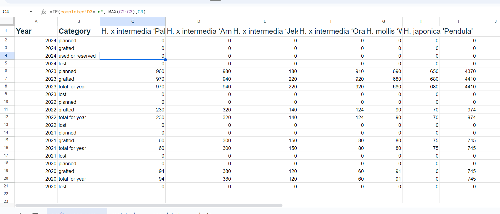
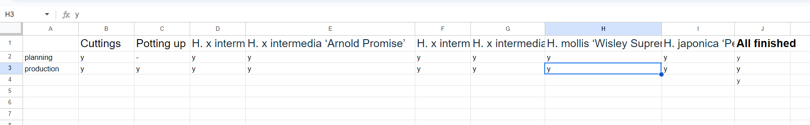

# witch-hazel
A bespoke command-line app developed in Python to manage plant production at the *Witch Hazel* nursery.

Code Institute - Third Milestone Project: Create a user-responsive command-line app to manage a particular domain task, solving a real-world problem, using a variety of programming constructs. The domain task in this case was the production of high-value garden plants by grafting as practiced by the *Witch Hazel* nursery.

More specifically, the *witch-hazel* app is designed to provide support for planning and keeping track of work done in the production of grafted Hamamelis plants by the owners of the nursery.


*A very common cultivar of H. x intermedia ('Arnold Promise') giving a spectacular show of leaf colour in mid-October*

<!-- TOC start (generated with https://github.com/derlin/bitdowntoc) -->

- [The user story](#the-user-story)
   * [Specialist growers](#specialist-growers)
   * [The plant production workflow](#the-plant-production-workflow)
- [What the customer wants](#what-the-customer-wants)
- [System design](#system-design)
   * [The 'rootstock' worksheet ](#the-rootstock-worksheet)
   * [The 'grafts-year-zero' worksheet](#the-grafts-year-zero-worksheet)
   * [The 'plants' worksheet](#the-plants-worksheet)
- [The program's original workflow and the technical issues with the technology used](#the-programs-original-workflow-and-the-technical-issues-with-the-technology-used)
- [The program's workflow:](#the-programs-workflow)
   * [Seasonal tasks in order](#seasonal-tasks-in-order)
   * [ad-hoc tasks](#ad-hoc-tasks)
- [Bug fixes and warning resolution](#bug-fixes-and-warning-resolution)
   * [Bugs](#bugs)
   * [Warnings](#warnings)
- [App robustness](#app-robustness)
   * [Numerical vs character/string entries](#numerical-vs-characterstring-entries)
   * [Out of range numbers](#out-of-range-numbers)
   * [Yes or no responses](#yes-or-no-responses)
- [Programming philosophy](#programming-philosophy)
- [Sharing the hamamelis google spreadsheet](#sharing-the-hamamelis-google-spreadsheet)
- [Registering for Heroku and using it](#registering-for-heroku-and-using-it)
- [Lessons learned](#lessons-learned)
- [Other unresolved issues and future development](#other-unresolved-issues-and-future-development)
- [Credits](#credits)

<!-- TOC end -->

<!-- TOC --><a name="the-user-story"></a>
## The user story

Laura and Donal are joint owners in a specialist horticultural business based in rural Roscommon. Their main business is in growing and selling wholesale high-value shrubs and flowering plants, mostly to garden centres all over Ireland and Europe.


<!-- TOC --><a name="specialist-growers"></a>
### Specialist growers

Their company, *Witch Hazel*, is named after the beautiful group of plant species (all grouped under the genus name _Hamamelis_) upon whose propagation the couple made their reputation soon after leaving agricultural college. This genus, whose English-language common name is the Witch Hazel, is a slow-growing shrub that produces masses of delicate yellow, orange or red flowers in mid to late winter and whose leaves turn spectacularly coloured in autumn. Most of the cultivars grown by Laura and Donal are descended from _Hamamelis x intermedia_, a cross between Japanese witch hazel (_H. japonica_) and Chinese witch hazel (_H. mollis_), but they also grow for sale cultivars of both parent species (i.e., _H. mollis_ and _H. japonica_). All the plants they grow for sale are propagated by means of grafting buds onto root stocks of a third Hamamelis species, _H. virginiana_, the American Witch Hazel, which doesn't produce either such beautiful winter flowers or such rich autumn leaf colours as any of its East Asian relatives, but provides a hardy root upon which the its more spectacular relatives can thrive. Another advantage of the procedure is that grafted plants will begin flowering several years younger than plants grown on their own root. The labour cost of producing such grafts is what drives the high market value of garden varieties of Witch Hazel on the wholesale and retail markets.


<!-- TOC --><a name="the-plant-production-workflow"></a>
### The plant production workflow

The two owners have jointly developed a highly efficient way of producing such grafted plants. They have a plentiful standing stock of _H. virginiana_, which they propagate by taking soft-wood cuttings in the autumn, which they leave to root over the course of the Roscommon winter (in Year Minus Two). The following spring (around about April of Year Minus One), they pot up all the cuttings that have rooted successfully into oblong three-litre pots and grow them on until they become small, one-year-old pot plants (in Year Zero). In late winter of Year Zero (usually early to mid March), they graft onto those young plants (referred to as 'rootstocks') carefully selected buds (called 'scions') taken from their lovingly tended stock of mature cultivar specimens. The resulting grafted plants are then cared for for four to five years before being offered on the market as small bushes (about 40cm to 1 m tall) still in their original pots. Once the graft has sealed successfully (there may be considerable losses during the period before the graft seals), caring for the small plants becomes a good deal less labour-intensive; the work mostly involving keeping them watered and fed (and free of waterlogging), controlling weeds, and removing and disposing of any losses. The vast majority of the work is expended on at the early stages of production: making and potting up the rootstocks from cuttings and then grafting the scions onto those rootstocks when they are ready. The early aftercare of the new grafts also takes up quite a deal of work time. For this reason, the profitability of each year's production depends largely on guessing correctly how many plants to graft to satisfy demand a few years down the road, and making sure at the outset that they have enough healthy, potted-up root stocks available on which they can graft all the plants they want every year just as winter is turning to spring.

A new distribution network they had been developing led them to increase the number of cuttings of rootstocks taken from 2021 on, and these extra rootstocks were ready for grafting in 2023, significantly increasing the nursery's workload and planning/documentation overhead. This is why they expressed a need for a new bespoke production support app.

Donal explained the workflow in _Hamamelis_ production as follows:
- Green woody H. virginiana cuttings are taken in October/November and inserted with regular spacing in open ground (in a sheltered spot and well-drained, gritty and nutrient-poor soil). Those of the cuttings that successfully produce roots are potted up in April/May of the following year. Donal tells me that most losses at this stage are incurred in the form of cuttings that fail to root. That's why they take many more cuttings than will eventually be needed. Rooted cuttings not needed for grafting almost a year later (in Year Zero &ndash; see below) are disposed of without ever being potted up. The couple always try to avoid such wastage, although after years over which few rooted cuttings die, they will often have a surplus of rootstocks ready for grafting. Such surplus rootstocks are rarely still suitable for grafting a year later, so &mdash;with a few exceptions&mdash; they are usually disposed of.
- As compost and pots (the only other critical inputs) can be ordered at short notice, neither input represents a bottleneck risk for the couple. They therefore don't need these variables to be modelled in the program for the moment.
- The production process currently does not involve any repotting; each successfully rooted cutting is potted at the very outset into its final three-litre pot.
- The rooted, potted-up cuttings of H. virginiana (from the cuttings taken in Year Minus Two and potted up in Year Minus One) are grown on for a full season and are readied for grafting in February to March of Year Zero (the precise time of year depends on the weather and the seasonal maturity of the scion buds to be grafted onto them &mdash;they should be swelling visibly but not yet open).
- The couple can't recall any year in which there was any shortage of scion buds, though actually selecting, cutting and preparing them correctly is a painstaking and time-intensive job.
- Actually joining the scions onto the rootstocks is also a highly skilled and time-consuming task. But here again, the tools and materials required (a grafting knife per worker, grafting tape and horticultural wax) are easy to obtain at short notice.
- After the hard graft of grafting has been completed, the new baby plants are carefully placed in intensive care in the couple's polyethylene tunnel for about two months, during which time there may be substantial losses (in bad years up to 40%) through failure of the graft to fuse.
- Once that period is over, the plants are taken outside to a sheltered spot on open ground. Their three-litre pots are buried to the neck in well-drained, humus-rich soil to reduce the risk of drying out. They will remain there for several years until they're large enough for sale. The youngest cohort generally offered for sale are in their fifth year from Year Zero. All the plants are watered, weeded, cared for and re-spaced where required, and any losses (which are generally much less frequent once the plants have survived Year One) are removed intermittently and disposed of.
- Each year's production is kept together and grouped by cultivar, but particular plants that are growing particularly well or particularly slowly may be promoted or demoted to another year cohort where appropriate.
- Unsold Year-Five plants may be repotted and grown on for sale as more mature specimens in subsequent years. However, this part of the production process has not yet been modelled in the *witch-hazel* app.

Both Laura and Donal often refer to the ominous sounding "Year Zero", but happily what they mean by the term is the calendar year in which they actually do the biggest job in the whole production process: actually making the grafts. You could say that they make rootstock cuttings in autumn of Year Zero Minus Two, pot up the successfully rooted cuttings in the spring of Year Minus One and do the grafting work in February to early March of Year Zero. The plants thus produced are thereafter classified by age, with newly grafted plants being labelled "Year-Zero plants", which become "Year-One plants" at the end of the calendar year (when the year is closed out and a new production year begins), with Year-One plants becoming Year-Two plants and so on. With a few exceptions irrelevant for our purposes, the plants are not ready for sale until they reach Year Five. 

- - -

<!-- TOC --><a name="what-the-customer-wants"></a>
## What the customer wants

Laura and Donal have asked me to provide them with a simple command line program to help them plan their propagation, grafting and crop management activities while the plants are being grown on for sale. They don't need any fancy graphics or sophisticated GUI, but they do want the program to be fairly simple to use and maintain, and to guide them through each step of the workflow. They want it to serve the following purposes:
- maintain a list of the stock of _Hamamelis_ plants destined for sale wholesale to garden centres and the like, grouped according to age/size and cultivar
- plan and keep track of the process of producing the cuttings for rootstocks, potting them up and growing them on
- update and show the number of potted rootstocks available every year for grafting
- plan the numbers of each cultivar to be used as scions on the root stocks, warning the couple when there are not enough rootstocks to execute the plan in full
- record throughout the year any losses incurred (for whatever reasons) by cultivar and age, as well as any acquisitions (whether by purchase from a third party or via any of a number of horticultural tricks that the couple have up their sleeves)
- show the flexibility to allow the couple to hold back particularly slow-growing specimens for another year and to reclassify plants that have grown particularly well in a particular year so that they effectively skip a year. Since they tend to do this sort of work whenever they get time throughout the year, they should be able to do this intermittently at any time of year.

N.B.: They currently grow six different cultivars for sale (but might expand their range in the future if they can find attractive cultivars free of plant breeders' rights fees). The couple have told me that they have no immediate plans to increase the number of cultivars they are using and that the functionality to add a new cultivar to the list (and remove existing cultivars) can wait until a later iteration of the program.  They also feel the need to see an overview of the data on-screen is something that can happen later.

"That's enough for the moment," said Laura, "once we have a system that can do those things, we'll be able to plan better. And once we've seen the benefits, we'll have a look at what might still need doing. The main thing we need right now is something that keeps our records straight, so we can compare like against like when looking for areas where we can improve our efficiency and/or rebalance the numbers of the various cultivars we produce. We can start looking at what we still need to do to improve the process control and overview once we've got the thing going. And then later still we can take a look processes both upstream and downstream of the actual production procedures ... maybe even in the sales area ... after we've bedded in our basic  system. We can even have a look at applying the system to our rose production business if it looks like it might save us a bit of time and money there too. But let's not get ahead of ourselves."

- - -

<!-- TOC --><a name="system-design"></a>
## System design


*Some flow charts portraying a selection of important witch-hazel worklflows*


Accordingly, I prepared a series of outline flow charts in consultation with Laura and Donal on the basis of the needs they described to me. Once they'd approved the charts, I began thinking about actually programming the various functionalities.

For simplicity's sake, and because I thought the data was not enormously complex, I decided to store it all on a single google spreadsheet, which I simply named 'hamamelis'. It contains four worksheets.
- rootstock
- completed
- grafts-year-zero
- plants

The data should be read as follows.

### The 'grafts-year-zero' worksheet
The grafts-year-zero worksheet contains two more columns than the number of cultivars of _Hamamelis_ currently cultivated by the *Witch Hazel* nursery. 
- The first column identifies the year to which the data in the corresponding row refers.
- The second column tells any human or machine reader whether the figures in the corresponding row refer to numbers of grafted plants that the couple originally planned ('planned'), that they actually made ('grafted'), that they currently have either already used up or committed to in planning ('used or reserved') and, finally, that they have since lost. The 'grafted' figure is the total number of mature rootstocks (potted up in Year Minus One) upon which a graft of the corresponding variety has been made. For changes made to it programmatically on closing out the year, see below.


*The grafts-year-zero worksheet as it might look at the start of a growing year (2024). Notice that the formulae are already in place, ready to process user entries through the App*



*The grafts-year-zero worksheet as it might look at the end of a growing year (2024)*

<!-- TOC --><a name="the-rootstock-worksheet"></a>
### The 'rootstock' worksheet 
- The first column (A) is a label to tell the witch-hazel program what year the figures in the corresponding row refer to. The labelling refers to the calendar year in which the relevant cuttings were taken.

- The top figure in the second column (B) shows the number of cuttings that the couple plan to take in the autumn of the current year minus one. The figures below that represent the number of cuttings that the couple planned to take in each relevant year minus one in the past.

- The third column (C) shows the number of cuttings that they actually took in the relevant year. Cuttings that failed to root are not recorded in the system: the lost cuttings simply end up not being potted up.

- The fourth column (D) shows the number of cuttings that rooted successfully and were potted up during the spring. It is a representation of work done, and does not increase when immature rootstocks are acquired from an outside source, nor does it reduce when such rootstocks are lost through disease or damage, nor when they are used up in the grafting process. Notice the change in nomenclature: successfully rooted _cuttings_ begin to be referred to as _rootstocks_ as soon as they've been planted in pots (potted up).

- The fifth and sixth columns (E and F) contains figures for losses suffered and acquisitions made during the relevant year.

- The seventh column (G) is simply the totals of columns D and F minus the figures from E.

- The final column (H) is special: cell 'H3' shows the number of rootstocks potted up this year (i.e. from cuttings made in Year Minus One) plus any gains and minus any losses since then. Cell H4 shows the numbers of mature rootstocks available minus the figures either for grafts planned for each cultivar or grafts made for each cultivar, whichever is higher. When the user decides that grafting has been completed for the year for a variety, then the planning figure for that variety is ignored.

Any rootstocks notionally left over after the year's grafting campaign is finished remain in the system until they are set to zero in Column H (From cell H4 down) upon creation of a new year. The reason for this is that two-year-old rootstocks will rarely be suitable for grafting when the time comes around again in the new year. They are generally physically disposed of (recycling the pots and compost) when the opportunity arises during the course of the new year.


*The rootstock worksheet as it might look at the end of a growing year (2024)*


*The rootstock worksheet as it might look at the start of a growing year (2024), straight after the user has executed the* ``Create new year/Close out current year`` *function (for 2024). Note that the user has chosen to enter a value for planned cuttings of 5200. That value can be changed at any time during the year by running Option 2* ``Plan this year's cutting campaign``*

<!-- TOC --><a name="the-grafts-year-zero-worksheet"></a>

<!-- TOC --><a name="the-plants-worksheet"></a>
### The 'plants' worksheet
The plants worksheet is a little simpler. It shows the current stocks of each cultivar of each age group &ndash; i.e.: the total number of grafts of that age currently in stock (ignoring any plants sold), adjusted according to the losses and gains subsequently recorded by the couple in the witch-hazel program using the record_loss, record_gain, hold_back and bring_forward functions (see below).


**.*


*The plants worksheet as it might look at the end of a growing year (2024)*

### The 'completed' worksheet
The _completed_ worksheet is simpler again. It simply shows whether all the various seasonal tasks in relation to cuttings and the grafts of each variety are done. The decisive entry here is the unassuming J4, which is always 'n' until all relevant fields are 'y'. It then becomes 'y' as well and the user can then close out the old year and open a new one. When the user does that, all entries in _completed_ are reset to 'n'.



*The plants worksheet as it might look at the start of a growing year (2024). No plants from this year yet*


*The plants worksheet as it might look at the end of a growing year (2024), after Option 0 has been run. Note the new figures added to the top row by the algorithm that starts the new year*


- - - 

## Development, implementation and deployment environment
All the code created during this project was written using gitpod.io, with version control using git.

The resulting App was deployed to a Heroku pseudo-terminal utility according to an early deploy approach (the App was deployed at an early stage of development to avoid see progress earlier and to avoid last-minute deployment surprises).


<!-- TOC --><a name="technologies-used"></a>
### Technologies used
Almost exclusively Python.


### The program's original workflow and the technical issues with the technology used

At the outset of programming, I wanted the app to call a run.py file in the usual way but to attach an argument after a blank space on the command line, depending on the task that the user wished to do at that time. Unfortunately, the Heroku pseudo terminal on which the app is destined to run does not allow the use of command-line arguments (or at least I have been unable to find a way of implementing such a command-line-argument-based design).

Due to some issues with my implementation of the Heroku architecture, I discovered this limitation rather late in the day. As a result I was forced redesign the app at the last-minuteto follow a different (and in my opinion much less elegant) logic. Originally, the user would have typed the run.py file name on the terminal, followed by a space and then a short string indicating what they wanted the app to do.

For example, they would have typed ``run.py plan_cuttings`` to plan their campaign of taking and preparing cuttings. But the Heroku pseudo-terminal automatically runs the ``run.py`` file without any arguments immediately upon opening, so everything must be based on an argument-free initial call. The description of the workflow below is based on my last-minute changes due to this difficulty. It should be understood, however, that workflow described below was not my first choice.

The time used dealing with this problem at the last minute may have affected some of the finishing work on the program in its first iteration. I have since dealt with most of those (mainly presentation) issues.

Having said all that, in hindsight, I now realise that my original design choice to type out each option as a command-line argument was unnecessary and that running the run.py file and inviting the user to type in the various options turned out to be a far more elegant solution.


<!-- TOC --><a name="the-programs-workflow"></a>
### The program's final workflow:
After considerable debate, it was decided to order the various tasks to be done in the program to match the tasks as they arose during the calendar year. One of the rejected candidate sequencing patterns was to follow the logical flow of what was actually done to individual plants, from planning the campaign to cuttings of _H. Virginiana_, through carrying out that plan in the autumn, through potting up rooted cuttings the following spring, then the planning of the grafting campaign and then doing the actual grafting of scions onto the rootstocks the following late winter, followed by all the ongoing maintenance tasks required to keep the grafted plants healthy and in order until ready for sale. Another candidate ordering was to begin each twelve-month period in the autumn, when the owners first begin to plan their cutting campaign.

Though beginning the workflow at the start of every calendar year and ordering app tasks like real-world seasonal nursery tasks added a little complexity to the design of the program, the reason for doing so was two-fold:
- Early winter (around the Christmas holiday time), being the quiet time for the couple, was the best time for them to check on the work they had done over the year and to ensure that it was properly recorded in the App.
- The couple could more easily tick off tasks done in the order in which they were done, thus making sure the data for each year was complete before closing out the year and beginning a new year.

Thus the program opens with the task of planning the grafting campaign (for each cultivar) (which happens in late winter &ndash; in February or March), going through each subsequent seasonal task in calendar order, following these with the non-seasonal maintenance tasks of the nursery and finishing with the final step of closing out the calendar year and preparing the spreadsheet for the data to be input in the following year.

In the App's main menu, the five seasonal tasks are grouped together as Options 1 to 5 at the top of the menu, with the non-seasonal tasks grouped below them. The final task of the year is shown at the bottom of the menu, in orange if the option is disabled (because all seasonal tasks are not yet complete) and in green if it's enabled.


*The main menu as it would be seen before completing all the tasks of the year*


*Option 0 changes to green when all the seasonal tasks are complete.*

<!-- TOC --><a name="seasonal-tasks-in-order"></a>
### Seasonal tasks in order

Here, then are the seasonal tasks as they appear in the main (and only) menu of the program, along with their data dependencies.
1. **Plan grafts for this year** (dependent on the mature rootstocks available and on the cultivars listed in the system) (Febuary or March)

If the user chooses 1, they are shown the list of cultivars and asked to choose the cultivar for which they want to plan grafting.

On condition the planning task has not already been completed, they are given a variety of relevant information (rootstocks available, etc.) and invited to enter a planned figure (or to replace any existing planned figure). If the planning task has already been recorded as completed, they are asked if they wish to reopen it.

They are prevented from entering more planned grafts than there are grafts available for planning.

Finally, they are asked if they have completed the planning task for that cultivar.


*The list of cultivars as they appear after the user chooses Option 1*

2. **Record grafts taken** (cross-checked against rootstocks and broken down by cultivar) (late March to April)

This option puts the planning into action. The user is again shown the list of cultivars and asked to choose one. They are then invited to enter the number of grafts the have actually made for the relevant cultivar (since their last entry, where relevant). If they have previously made an entry, the new entry is ADDED to the old one.

Again, they are not allowed to enter numbers greater than the number of rootstocks currently available.

Task completion questions are dealt with as with Option 1.


3. **Record rooted rooted cuttings potted up** (no App-supported planning needed: numbers depend almost exclusively on the number of cuttings taken in the previous season that have successfully rooted) (April to June)

This function works like Option 2, except that the user is not restricted in the number of cuttings they can pot up (except by the general system limit of 10,000). They are, however, shown the number of cuttings made in the previous year.

Task closure is handled as above.

4. **Plan this year's cutting campaign** (depends on projected needs; there is rarely an issue with the amount of material or space available suitable for taking cuttings) (August to September)

This option simply asks the user to enter a planned figure for cuttings to be taken this year. Any previous figure is overwritten.

The only numerical limit is the system limit of 10,000.

Task closure as above.


5. **Record cuttings taken** (October and November)

This option gives the user the planned figure and asks them to enter a figure actually taken. The figure given is limited only by the system limit and the figure entered is added to any number previously recorded. 

Task closure as above.


When all tasks for cuttings, rootstocks and all cultivars have been completed, Option 0 is enabled.

### Non-seasonal tasks in order

They are followed by the non-seasonal tasks:
6. **Record plant losses** (for both rootstocks and each variety of grafted plants)

This is really two functions, one for rootstocks and one for the various varieties of grafted plants.

The user is first asked whether they want to enter a loss for rootstocks. If so, the user enters that loss. They can only enter losses for rootstocks potted up this year.

Final review with the customer showed that this in hindsight was an error, as it should really also be possible to enter losses for rootstocks maturing this year, but since losses of potted up cuttings in Year Zero are far lower than in Year Zero minus One (straight after potting up), it was not considered a showstopper. It must nevertheless be repaired in the next iteration.

If the user wants to record a loss of cultivars for a particular notional age, then they answer 'n' to the first question. Are then shown the cultivars from which to choose. Then they choose the affected age and enter the number of plants of that cultivar and age that have been lost.

In any case, the user can't record greater losses of any category of plant than are in the nursery.

7. **Record plant gains** (ditto)

This works essentially like Option 6, though the limit is simply the system limit of 10,000.

8. **Hold grafted plants over for one year** (by cultivar and year)

This works similarly to the two previous two, though it: 

- contains no rootstock choice and
- adds the number lost from the chosen year to the previous year

The logical number limits apply: you can't hold back a Year-One plant, and you can't hold back more plants of any category than are in the system.

9. **Bring grafted plants forward one year** (by cultivar and year)

This function does the same as Option 8, but in the opposite direction.


### Closing the current year and preparing the data structure for the next year.
And finally, when at least all the seasonal tasks have been marked as completed, it's time for

0. **Close out current year** (enabled only if all seasonal tasks have been completed)

If the user chooses this option while it's marked as disabled, they are told to go back and finish work on the current year before beginning work on the new one.

If it's enabled, however the App does the following:

**On the _grafts-year-zero_ worksheet:**

When a new year is created, the 'used or reserved' figure becomes irrelevant (though it was important to keep track it in some of the Year-Zero tasks). so it is replaced as described below.

Logically enough, the numbers for plants grafted this year (minus any losses since the grafting was done) are passed into the 'plants' worksheet.

Then four new rows are inserted for the current year at the top of the worksheet and the figures for the old year and all previous years are moved down correspondingly.

Figures for rootstocks of years previous to Year Zero Minus One are zeroed out, as most of them are no longer suitable for grafting in Year One (as opposed to Year Zero &ndash; the current year). Any exceptions to this rule (i.e. rootstocks judged to be still suitable for grafting in the following year) are accounted for by treating them as if they were acquisitions. 

Finally, the 'used or reserved' row for the previous year is overwritten by a row 'total for year' showing the values passed to the plants worksheet (i.e. the value for 'grafted' for the year just finished minus any losses recorded in that year).

All data now outside the first four columns (now populated either by zeroes or formulas) can no longer be edited.

<!-- TOC --><a name="bug-fixes-and-warning-resolution"></a>
## Bug fixes and linting

<!-- TOC --><a name="bugs"></a>
### Bugs and debugging
Bugs were fixed as they arose function-by-function during smoke testing.

As far as practicable, all bugs are resolved separately and the Bug resolution is recorded in Git commits separately, prefixing the commit text with "Debug: ".

During final testing (which was completed after the linting was done), however, a number of bugs came up due to the interdependency of the various functions (and human frailty, of course). Their resolution is documented in git.


<!-- TOC --><a name="warnings"></a>
### Linting

I did my linting exclusively using the pylint tool towards the end of the development process, which uncovered a number of issues in my code that required extensive last-minute 
changes to the project.

I ran the pylint on each of my *.py files in turn. While the vast bulk of the messages produced by tool were useful to me and therefore resolved, I did leave a number of messages unresolved as I did not consider them critical to my project. 

In my text modules, for example, I left almost all messages of the form 

``Missing function or method docstring (missing-function-docstring)``

unaddressed, as they appear to be making an unnecessary demand for a explicatory blurb on each of the simple functions contained in such files, most of which are pretty much self-explanatory.

In the run.py file, however I endeavoured to correct every single one of the issues raised by pylint, even if they seemed trivial, as I found that they often uncovered deeper problems in my code structure.

This was particularly true of messages telling of variables being redefined within a narrower scope, which required an extensive revision of &ndash;and improvement to&ndash; my code.

I will leave discussion the few pylint messages left in my run.py file (my main module) to the _Unresolved issues_ section.

- - -
## Unresolved technical issues

Very occasionally during during development and testing the app failed to open, giving users the following 503 error:
```
Traceback (most recent call last):
  File "/workspace/witch-hazel/run.py", line 14, in <module>
    SHEET = GSPREAD_CLIENT.open('hamamelis')
            ^^^^^^^^^^^^^^^^^^^^^^^^^^^^^^^^
  [...]
gspread.exceptions.APIError: {'code': 503, 'message': 'The service is currently unavailable.', 'status': 'UNAVAILABLE'}
```

It's clear that this is due to a transient (though not entirely unrepeated) third-party issue. The custom error messages simply asks the user to try again, since in my experience such issues are almost always extremely transient, lasting no more than a second or two.

However, I would like to put together a try/except clause to deal with this issue elegantly in a later iteration.

When running _Option 0_ (creating a new year), a warning appeared, apparently in response to line 907 of my ``run.py`` module (``"rootstock.update(cell_range, column_formulae, value_input_option='USER_ENTERED')``).

The warning went as follows:
```
"/workspace/.pyenv_mirror/user/current/lib/python3.12/site-packages/gspread/worksheet.py:1069: UserWarning: [Deprecated][in version 6.0.0]: method signature will change to: 'Worksheet.update(value = [[]], range_name=)' arguments 'range_name' and 'values' will swap, values will be mandatory of type: 'list(list(...))'
  warnings.warn("
```

Ignoring the (to me!) strange unclosed parenthesis at the end, and following the suggestion of the body of the warning, I reversed the sequence of the first two parameters, but this only made matters worse. The program, now unable to identify the range to which to apply my insert command, simply inserted it on range A1:A3 (disastrously). Since the original code achieved what I intended it to achieve, I kept it (along with a note to revisit the issue in the next week or two).

I silenced the warning using the standard warning module.

However, I will need to address this deprecation issue as a priority task in the next iteration.

Finally, the format and presentation of some of the texts shown during user interaction on the heroku pseudo-terminal has seen a great deal of improvement over the course of development, but there is still room for improvement.

<!-- TOC --><a name="app-robustness"></a>
## App robustness

<!-- TOC --><a name="numerical-vs-characterstring-entries"></a>
### Numerical vs character/string entries

I used two functions to ensure that the user was not burdened unnecessarily with crashes due to invalid user entries.

One of the functions (``parse_yn_input()``) wrapped all ``input()`` functions requiring Yes or No answers, while the other (``parse_num_input()``) wrapped all ``input()`` functions requiring a zero or positive integer as their imput.

There should (and I've checked) be no ``input()`` instances not wrapped in one or other of my functions.

They are both recursive functions that call themselves however many times they need to until the user inputs the right values (in one case an upper or lower case 'y' or 'n' and in the other an integer between 0 &ndash; or occasionally 1 &ndash; and the corresponding maximum number).

Note: The above is not strictly true, as they both also allow the user to input ``exit``, ``help`` or ``help [n]`` (where [n] represents a number between 0 and 9, corresponding to each of the options the App contains). For more details on the help functions, see below.

As a result, the user can access the App's help options (see the section on Help) or leave the App altogether whenever it asks them to enter a value.

This almost completely reduces the risk of the App crashing due to incorrect user entries, though I can do very little about keyboard interrupts due to the accidental use of Control C, for example.


### Help functions 
The App provides both an extensive general Help text and a specific specialised Help text for each option provided by the app. The user must simply type in "HelP" (in any combination of upper and lower case letters) at the witch-hazel command prompt to access the general help text and the same string followed by a space and a number between 0 and 9 (``Help [n]`` where ``[n]`` is a number between 0 and 9) to access detailed help on the corresponding option.

The ``help`` provides three screen's worth of general help information, which the ``Help [n]`` variant provides a screen's worth of information on each of the Options available in the App.


*What you see after typing * ``Create new year/Close out current year`` *from the command prompt anywhere in the App*.

### Exiting the program
Typing ``exIT`` (in any combination of upper and lower case letters) from the witch-hazel command prompt will close the App.
---
<!-- TOC --><a name="programming-philosophy"></a>
## Programming philosophy

In the course of building this app (closely modelled on a more or less complex series of real-world processes), I found that I made only limited active use of the concepts of OOP in my code: though I used a very wide range of pre-coded third-party classes through importing a variety of packages, I created only one bespoke class specifically for the app (namely the NewYearController class in the new_year_controller.py file).

While I didn't feel the need to create classes for any other purposes in this iteration, no doubt some reorganisation of the code making use of OOP principles will make sense in later iterations.

I am quite sure that employing some of OOP's encapsulation and inheritance design features may make my code much less opaque and much more reusable.

### Segregating text resources for i10n and l10n

In an attempt to leverage my background in internationalization, localization and technical translation, I was careful to segregate into minimally technical resource files so that if it became necessary in the future that the app be localized into another at least Western, left-to-right language, that the work will be easier.

While the flow of the text (and the level of technical difficulty for any localizer) is not ideal (as there are various interruptions to most of the texts), it is at least technically possible for a localizer to translate the texts and to some extent adapt such programming elements as colours, command prompts, etc. to local norms, conventions and user expectations.

While a lot more could be done to the technical structure of the app to make the life of the localizer and ultimately its translator(s) easier (perhaps creating an algorithm to automate text formatting, for example), the app could be said to be, at least in principle, _internationalizable_.


## Manual testing

### Robustness testing
The approach I used to robustness testing was considerably eased by my use of the two user entry control functions described above.

Instead of having to test practically any likely keyboard combination the user might be likely to enter, I could concentrate on testing that the numerical upper and lower bounds were being set correctly by the App.

My final testing, however, did involve entering the following inputs among others at the command prompt (twice: once for a prompt expecting a numerical input and one expecting a ), to ensure they were all handled correctly:
``'  '`` Should force the user to try again
``''`` Should force the user to try again
``'4,300'`` Should render as a 4300
``'HeLP 6 afdadf'`` should render as ``help 6``
``'  y'`` Should render as 'y'


### Features testing

During development, I unit tested each of the functions of the App as I developed in an ongoing process.

When almost finished programming work, I then tested it systematically as if I was a user.

I needed to run the App several times, correcting as I went, running each functionality in turn, and checking for correct presentation to the user and for correct results on the spreadsheet, at the end of the program.

I ran it for 2024 figures several times, keeping an end-of-2023 copy of the sheet to ensure I was working from the same basis.

I tested them for the behaviour described above, but I did not formally create any test cases.

### Browser compatibility
I have successfully tested this App using the latest versions of Edge and Chrome.

I did no checks on older versions or any other browser.


### Device compatibility and responsiveness
This App is responsive enough for use on smaller standard Android mobile devices.


## Setting up the environment
The first task I completed was to create the spreadsheet with which Laura and Donal's app are going to interact. As I already have a Google account, there was no need to set up a new account. I simply navigated to https://docs.google.com/spreadsheets and created a Google spreadsheet (called "Hamamelis") that contained the four pages illustrated and explained in this document, inserting the historical data for the period up until 2022 given to me by Laura and Donal.

I then set up the google API to give Laura and Donal's new App read and write access the spreadsheet (while they are authorised to view teh spreadsheet, they will not be allowed to modify the data on it directly by hand).  If the need should arise to do so, they will have to talk to me.

I provided this authorisation by clicking on the Share button at top left from within my "Hamamelis" Google spreadsheet and choosing my personal Google account. I then navigated to https://console.cloud.google.com/, selected the "Select a project" button and selected "New project".  I named my project "Hamamelis".

I then clicked "Select Project", which brought me onto the new "Hamamelis" project dashboard page.  

From there I selected the Navigation menu and selected "APIs & Services / Library".

There I enabled two APIs: one for Google Drive (to generate the necessary credentials) and one for Google Sheets.

### The Google Drive API

To initiate the Google Drive API ran a search for "Google Drive", which gave me "Google Drive API" at the top of my search results list. I clicked on it and then on the "Enable"  button on the page that then appeared. This brought me to the Google Drive Overview page.

On this page I clicked on the CREDENTIALS tab and then on the "Create Credentials" button under that tab, I chose Google Drive API from the dropdown menu and then "Application Data" to answer the question "What data will you be accessing?" and then clicked 'Next'.

I entered "hamamelis" as my Service account name, along with a short description of purpose of the service account. I then pressed the "Create and Continue" button, and then chose the role "Editor" and pressed the "Continue" button. Leaving all other actions blank, I then pressed "Done".

This brought me back to the Credentials page for the Google Drive API, where I could see my newly created hamamelis service account at the bottom of the page. I clicked on it to get to the hamamelis service account page and then went to the Keys tab, where I chose "Create new key" from the "Add Key" the dropdown list.

This created a json file containing the necessary API credentials for download to my machine.  Once the download was complete I noted the directory to which it was downloaded.


### The Google sheets API

Once all that was done, I navigated back to the APIs and Services/Library page and searched for the Google Sheets API, which yielded a single result. I clicked on it and then on the Enable button in the Google Sheets API page.


### The Github repository and the Gitpod workspace

I set up the Github repository for my project (under the name "witch-hazel" &ndash; https://github.com/JaimeHyland/witch-hazel) using the template made available by Code Institute at https://github.com/Code-Institute-Org/p3-template by clicking on the "Create a new repository" option on the "Use this template" dropdown list (setting the name as "JaimeHyland/witch-hazel"). I made the repository public (leaving the radio button selected by default as it is).

I then opened my personal CI Students Gitpod dashboard and created a new Workspace including all the files created for the witch-hazel repository by the CI p3-template. I did so by clicking on the *Create new workspace* button, selecting the witch-hazel repository from the list of all my existing repositories in my personal Github account and then clicking on *Continue*. In the workspace that then opened, I checked to make sure that all the files listed in the Code Institute instructional video were present.


### Sharing the hamamelis Google Spreadsheet

I located the credentials file which I had already downloaded and dragged & dropped it into the root directory of my gitpod witch-hazel workspace and then renamed it "creds.json".

I then copied the client_email value from the creds.json file and opened my hamamelis Google Spreadsheet and clicked on the "Share" button at top right. I pasted the client_email value in to the Add people and groups into the text box that then appeared, chose "editor", unchecked the "notify people" checkbox and pressed "Send" and then "Done". This set up the permissions for my app project to access and edit my hamamelis spreadsheet.

To prevent the sensitive information contained in the creds.json file from being added to the files saved in the github repository, I added the file name to the list of files to be ignored by git to the "gitignore" file before running a git stage, commit, push operation.

I then installed gspread and google-auth by typing the commands ``pip3 install gspread google-auth``.

### Getting started with the coding

Doing this put me in a position to begin my coding, my first step being to write ``import gspread`` and ``from google-oauth2.service_account import Credentials`` at the top of my run.py file, followed by five constants to be used by the App to maintain communication with my Google spreadsheet:
- SCOPE (which lists the URLs of the three APIs that the App will need in order to run)
- CREDS (which tells the App the file where the relevan credential values are to be found)
- SCOPED_CREDS (which relates the CREDS to the SCOPEd APIs for which they are valid)
- GSPREAD_CLIENT (which represents the client of the App as defined by the SCOPED_CREDS)
- SHEET (the actual spreadsheet the App will be working with)

From here on in, I suggest perusing the Git commit logs combined with my inline comments to get more details on the progress and content of my Python code. 


<!-- TOC --><a name="registering-for-heroku-and-using-it"></a>

## Registering for Heroku and using it

### Initial registration

My first step to facilitate deploying my App on the Heroku Python environment was to add my app's dependencies into my requirements.txt file (which the Heroku environment refers to when installing the necessary features on creation). I do this by running `` pip3 freeze > requirements.txt``, which collects all necessary installations on the Gitpod workspace and writes them into the requirements.txt file.

The next step was to create an account with Heroku at heroku.com. I clicked on "Sign up for free" and filled out the sign-up form (using a genuine email address and with Role as Student and country as Germany, where I currently live), and then clicked "Create free account". I then confirmed via the validation email that Heroku sent me and set a password. And I then logged and accepted the Heroku terms of service.  Heroku now requires a real 16-digit credit or debit card for all its accounts and requires users to implement a minimum two-step validation process to use its hosting services. The form of validation I chose was using a code number sent to my smartphone on each log-in via Salesforce's Authenticator app. After a variety of minor teething issues I was eventually able to set up my account.


### Activating Code Institute's Heroku Student Pack

Once I had successfully set up my Heroku account, I navigated to www.heroku.com/github-students, clicked on the "Get the student offer" option, verified my status as a Github student and then clicked "Authorize heroku". I then verified my billing information and confirmed the credit card that I had already entered.  I then entered my first and last names, with "Code Institute" as my school name, and pressed "Send". On the dialog that then opened, I indicated my agreement with the Heroku Terms and Conditions by pressing "Agree" and left the site.

When I checked my account on the following day (at dashboard.heroku.com/account/billing), the appropriate sum was added to my Platform Credits.


### Setting up our App in the Heroku environment

From my personal dashboard in the Heroku site, I selected "Create new app" from the "New" dropdown list, gave it the app name "witch-hazel", chose "Europe" as its region and then pressed "Create App". I then clicked on the "Settings" tab and clicked on "Reveal Config Vars". From there I created a CREDS config var (environment variable) and gave it the entire contents of the creds.json file as its value.

I then scrolled down the page a little, clicked "Add Buildpack" and added two buildpacks (python and nodejs, in that order), saving my work.

I then switched to the deploy tab, selected Github as the environment I wanted to deploy from (under "Deployment method") and pressed "Connect to Github". I then searched for and selected the witch-hazel repository.

I chose the manual "Deploy branch" option and waited until the deployment was complete. When that was done, I clicked on "View" and saw that my Heroku mock terminal had already started my witch-hazel app. I could then run a smoke test to ensure that everything was working in the same way as my App as already created in Gitpod and stored in my Github repository.

From this time on, I could run the "Deploy branch" option on the Deployment tab whenever I completed an important commit to github in order to ensure that I had successfully deployed the latest version of my app to the Heroku environment.

To get the hours of server time I need from Heroku, I needed to activate Eco dynos to allow my applications, including witch-hazel, to work. To set up the service, I went into the billing tab of on my dashboard and clicked on "Subscribe to Eco". After browsing through the information on the page, I clicked on Subscribe, confirmed that my subscription was now in existence and exited Heroku.

Rather nicely, these Eco Dynos go to sleep after a period, so that I don't have to pay for server time that I'm not using.


<!-- TOC --><a name="lessons-learned"></a>
## Lessons learned

In hindsight, I feel I may have bitten off more than I could chew. The complexity of this project caused it to run badly overtime. The effort however, taught me a lot about Python development and about translating complex procedures into formal code that may actually provide help to users.

In the light of this experience nd given the same chance again, I would have chosen a project that was inherently simpler than this one, though I've learned a lot of coding discipline and improved my programming muscle memory and reflexes through my long working through the project.

I would also have segregated my code at an earlier stage, and more systematically and more according to OOP principles than I managed this time round.


<!-- TOC --><a name="other-unresolved-issues-and-future-development"></a>
## Other unresolved issues, missing features and future development
As this App makes no claim to be anything other than a MVP, and aside from the unresolved technical issues discussed above, there is a long list of issues to be dealt with and objects for future development in the project. Amongst them are:

- A reporting tool to show the overall state of the data on the terminal (rather than relying on the users' read-only access to the google spreadsheet).
- A tool to tell users which task they still have left to do before closing out the year.
- An option to add new cultivars to the current list of six cultivars currently being cultivated.
- A series of routines to extract statistics from the raw data in google sheets (including such useful details as survival rates by age, stage and cultivar, etc.).


<!-- TOC --><a name="credits"></a>
## Credits
https://discuss.python.org/ 
https://www.w3schools.com/ 
https://www.digitalocean.com/ 
https://stackoverflow.com/ 
https://www.programiz.com/python-programming 

Thank you very much to my fellow students for their helpful suggestions and support, and in particular to my Student Welfare person, for her inspiration, encouragement and help in combatting impostor syndrome! 
